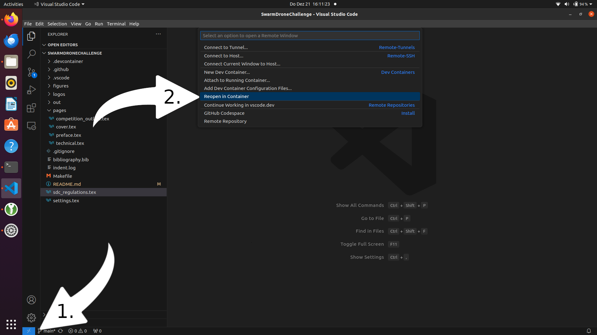
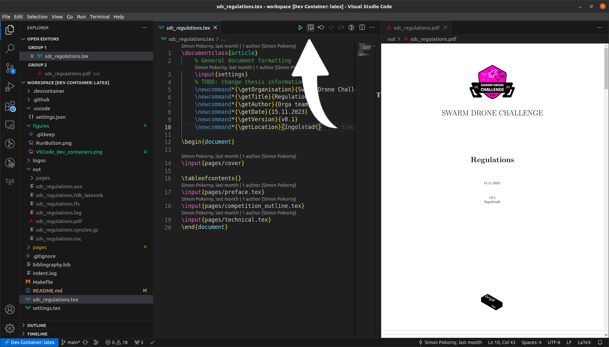

# Swarm Drone Challenge Rulebook

This repository contains a Latex project that contains the rules for the Swarm Drone Challenge. 
If you are a participant of the swarm drone challenge feel free to open issues to discuss questions or fork this repository and create a pull request with your proposed rule changes.
The document consists of a main file called  sdc_regulations.tex that references the files  `pages/technical.tex` and `pages/competition_outline.tex`. 
The file `technical.tex` contains all rules regarding the technical implementation of the drone and the `competition_outline.tex` file contains all the rules regarding the competition itself e.g. Flight Arena, Scoring. 

## Getting Started to contribute to this rulebook
To edit this document you can use any latex editor of your choice.
If you are using VS Code and have [Docker Desktop](https://docs.docker.com/get-docker/) installed you can simply use the [Dev Containers](https://marketplace.visualstudio.com/items?itemName=ms-vscode-remote.remote-containers) plugin.
This repository comes with a dev container configuration that contains the latex installation with all the dependencies you need.

### 1. Fork this repository
Create your own fork from this repository. 

### 2. Clone your forked Reposotry
```
 git clone git@github.com:<YOUR-GITHUB-NAME>/SwarmDroneChallenge.git
```
### 3. Open VS Code
```
cd SwarmDroneChallenge
code . 
```
### 4. Reopen in Container
Press at the blue button in the left bottom corner and select `Reopen in Container` from the menu.

### 5. Build pdf
Now you'll find a run button at the top that you can use to build the latex pdf as soon as you open a tex file.

### 6. Add, Commit and Push 
 ```
 git add
 git commit -m "message that describe the changes that you made"
 git push origin
 ```
### 7. Create Pull Request to BrigkAir Repository


